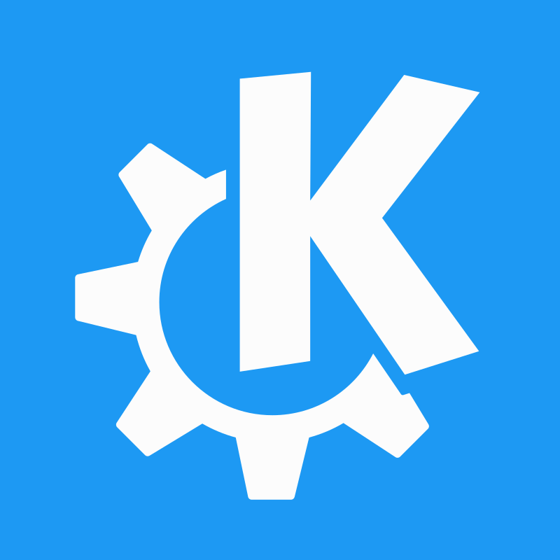

# Hello World! 👋

**Blaine Traudt**

- Freshman in the Raikes school at UNL
- Co-founded the LSW Programming club
- ✉️ [blaine@traudt.dev](mailto:blaine@traudt.dev)
- 🌐 https://traudt.dev (WIP) [[Studors](https://github.com/Unofficial-LSW-Programming-Club/studors) Demo Currently]

- ⚒️ [TypeScript](https://github.com/Unofficial-LSW-Programming-Club/studors) / [Java](https://github.com/blaine-t/sgJava) / [Python](https://github.com/LSW-Programming-Club/piMI)

- ✏️ [Arch Linux](https://wiki.archlinux.org/title/Arch_Linux) / [KDE Plasma](https://kde.org/) / [VS Code](https://code.visualstudio.com/docs)

- 👨 Pronouns: He/Him

- 🔑 GPG key: [`8D281DF6BDB25B4A`](https://github.com/blaine-t.gpg)

<!---
blaine-t/blaine-t is a ✨ special ✨ repository because its `README.md` (this file) appears on your GitHub profile.
You can click the Preview link to take a look at your changes.
--->
